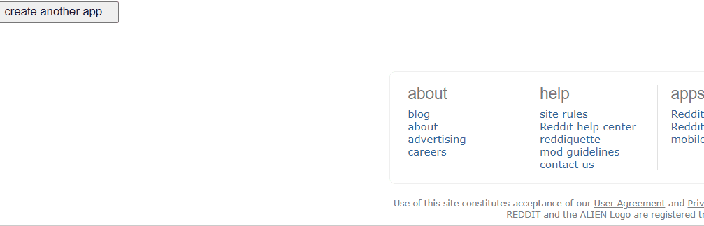
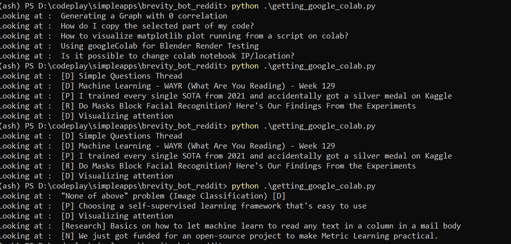

# BERVITY BOT FOR REDDIT

Accompanying code for medium article at : https://medium.com/@fanbyprinciple/creating-a-reddit-bot-to-do-your-bidding-9087a15d7a2f

Huge thanks to https://new.pythonforengineers.com/blog/build-a-reddit-bot-part-1/

### Simple find and reply

check `brevity_bot.py`

### for getting google colab notebooks

check out `getting_google_colab.py`

### Simple just read example

check out `just_read.py`

### Sample praw.ini file

check out `sample_praw.ini`

